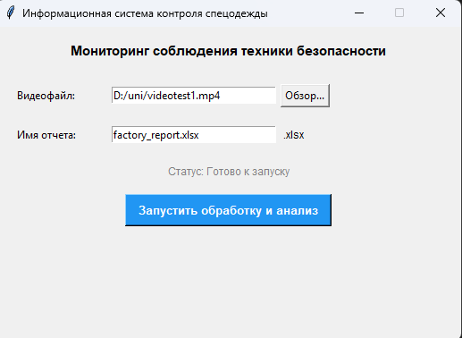
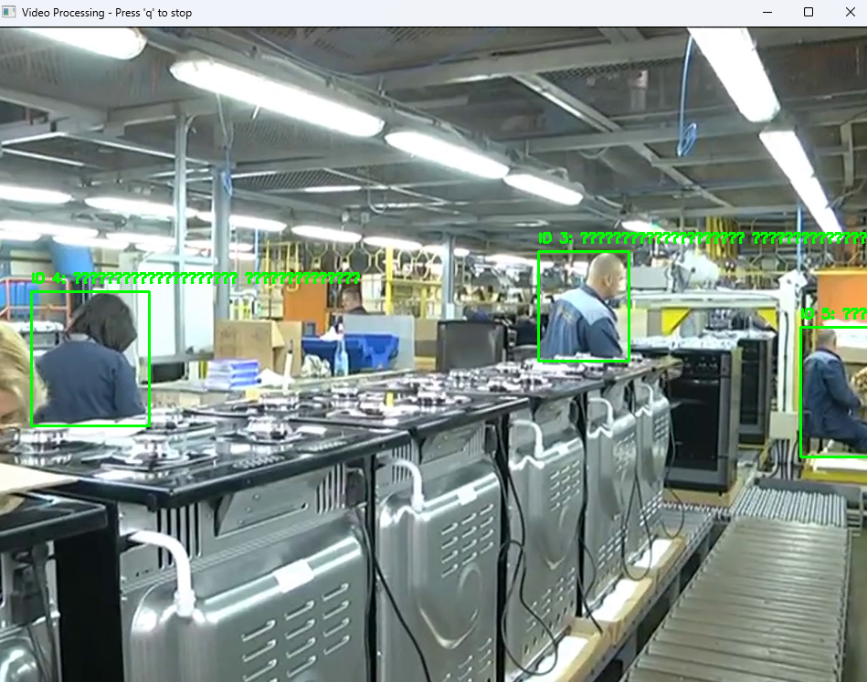
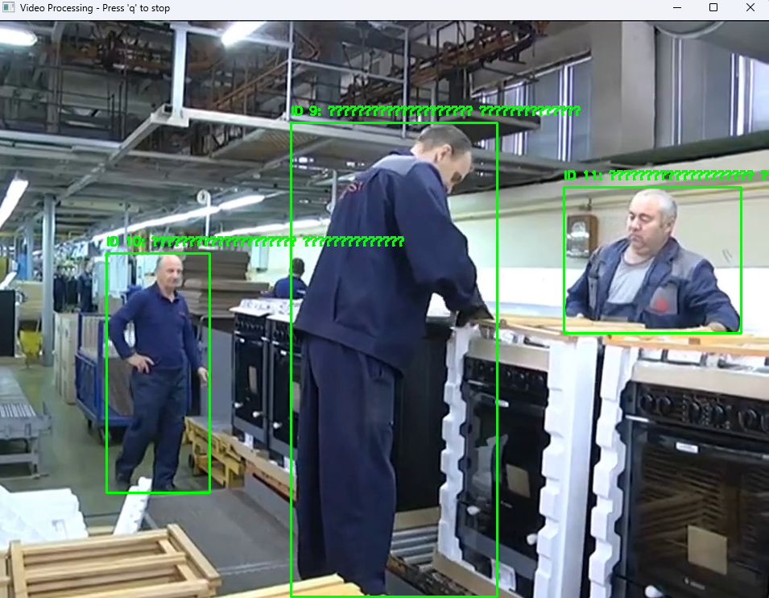
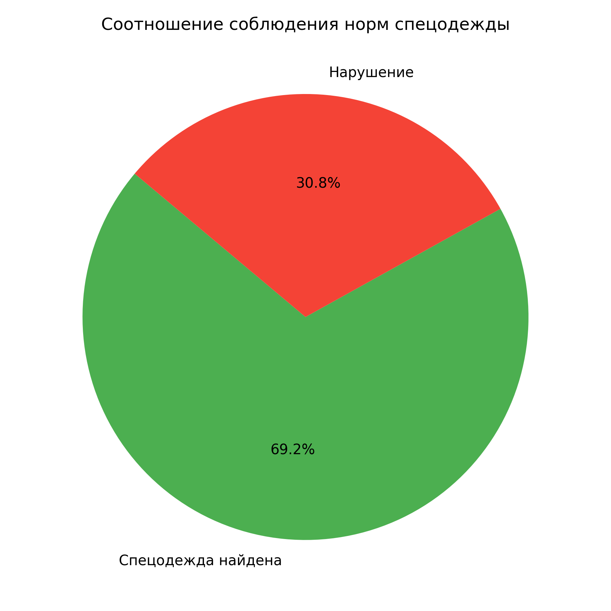
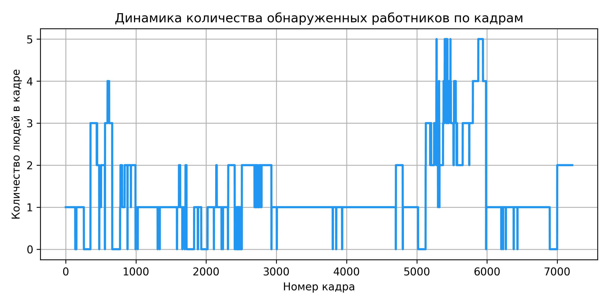

# Информационная система контроля спецодежды (СП ОАО «Брестгазоаппарат»)

Программный модуль автоматизированного видеомониторинга соблюдения правил охраны труда и контроля наличия спецодежды у персонала производственных цехов.

---

## 📌 Основные возможности

- **Детекция и трекинг персонала:** Обнаружение сотрудников на видеокадрах с помощью нейросети **YOLOv8** с присвоением уникального `Track ID`.
- **Цветовой анализ спецодежды:** Автоматическая верификация наличия фирменной спецодежды через обработку цветовых масок в пространстве **HSV**.
- **Графический интерфейс:** Удобное десктоп-приложение на базе **Tkinter** для загрузки видеофайлов и запуска анализа.
- **Автоматическая отчетность:** Формирование выгрузки в Excel (`.xlsx`) с фиксацией ID сотрудников, времени и статуса проверки.
- **Визуальная аналитика:** Автоматическая генерация аналитических графиков и диаграмм с помощью **Matplotlib**.

---

## 🛠 Стек технологий

- **Язык программирования:** Python 3.x
- **Компьютерное зрение и ML:** `ultralytics` (YOLOv8), `opencv-python`
- **Обработка данных и графики:** `pandas`, `matplotlib`, `numpy`, `openpyxl`
- **Интерфейс:** `tkinter`

---

## 🖼 Демонстрация работы

### 1. Графический интерфейс приложения (`1.png`)


### 2. Мониторинг соблюдения норм и фиксация нарушений (`2.png`, `3.png`)
| Детекция и сопровождение | Фиксация статуса спецодежды |
| :---: | :---: |
|  |  |

### 3. Автоматически генерируемая аналитика
| Соотношение статусов | Динамика активности по кадрам |
| :---: | :---: |
|  |  |

---

## 🚀 Быстрый запуск

### 1. Клонирование репозитория
```bash
git clone [https://github.com/ВАШ_ЛОГИН/factory-safety-control.git](https://github.com/ВАШ_ЛОГИН/factory-safety-control.git)
cd factory-safety-control
